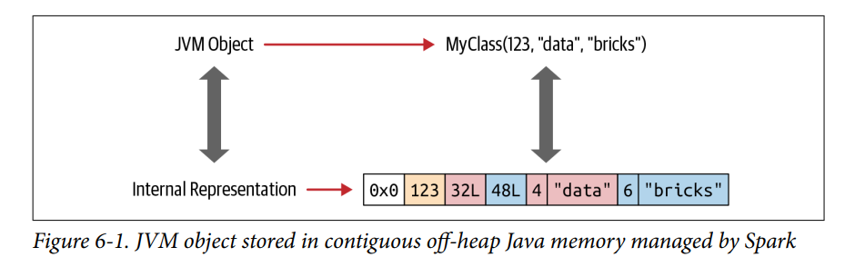

# Glossary

## Spark

### APIs

**RDD** Immutable distributed collection of objects with lineage dependency (i.e., how the RDD is constructed), partitioned across nodes in the cluster that can be operated in parallel. 

* The RDD API is not structured.
* Computation expressed in high-level structured APIs (Dataframe and Dataset) => low-level optimized RDD operations => Scala bytecode for executors' JVMs.

**Row** A generic untyped JVM object type in Spark, holding a collection of different types of fields that can be accessed using an index.

**DataFrame** A structured collection of generic objects Dataset[Row] (untyped).

* A DataFrame is an untyped view of Dataset.
* Python and R only support the untyped DataFrame API.
* Can let Spark infer schema.

**Dataset** A structured collection of strongly-typed JVM objects, dictated by a case class you define in Scala or a class in Java.

* Only supported in Scala and Java.
* Schema must be supplied.
* Dataset and Dataframe are unified as structured APIs in Spark 2.

### Storage

**Parquet** A column-oriented data storage format of the Apache Hadoop ecosystem.

**snappy.parquet** Data stored in parquet. compressed using the [snappy compression](https://en.wikipedia.org/wiki/Snappy_(compression)).

### Partition

**Disk partition** Partitions of data in hive table stored in HDFS. E.g., `df.partitionBy($"country")` will generate xxxx/country=abc/, xxx/country=xyz/ folders by country. (See [here](https://mungingdata.com/apache-spark/partitionby/))

**Memory partition** Partitions of data in memory used by computation in Spark. E.g., 

* Changing memory partitions:`df.repartition(100)` will split data to 100 partitions for Spark to work on, and `df.coalesce(10)` will collapse data to 10 partitions (if original number of partitions is larger than `n`, then `df.coalesce(n)` won't change the partitions).
* Writing partitions to disk: `df.repartition(200).write.parquet("xxx")` will generate 200 parquet files on disk.
* Reading partitions from disk: Partitions of data read from `spark.read.parquet` are determined by (see [here](https://medium.com/swlh/building-partitions-for-processing-data-files-in-apache-spark-2ca40209c9b7))
  * spark.default.parallelism (default is the total number of executor cores of the Spark application, see [here](https://spark.apache.org/docs/2.3.0/configuration.html))
  * spark.sql.files.maxPartitionBytes (default 128MB)
  * spark.sql.files.openCostInBytes (default 4MB)

### Components

**Worker node** A member of the cluster. It can be a virtual machine (JVM) or a physical computer.

**Executor** A process launched for a Spark application on a worker node.

**Shuffle operation** Operations in Spark that trigger shuffle events. E.g., `repartition`, `coalesce`, `reduceBy`, `groupBy`, `join`. https://spark.apache.org/docs/latest/rdd-programming-guide.html#shuffle-operations

### Configurations

**spark.sql.shuffle.partitions** The number of partitions to create after shuffling triggered by wide transformations. Large datasets might need higher values, while small datasets need a smaller number to save time by avoiding creating empty shuffle partitions that are not used: https://www.coursera.org/lecture/spark-sql/shuffle-partitions-Y2TDV

### Spark SQL

**Narrow transformation**  Any transformation where a single output partition can be computed from a single input partition. E.g., `select`, `filter` that can be done to each partition in parallel, since performing the operation in a single partition does not require information from other partitions.

**Wide transformation** Transformations like `join`, `group by` that require data shuffling among partitions. E.g., the group by operation cannot be performed in each partition in parallel because all records associated with a group by key might reside in more than one partitions.

**Stateless transformation** Operations like `select` , `filter` that do not require information from previous rows to process the next row.

**Stateful transformation** Operations like `count` , `join` , `group by` that require maintaining state to combine data across multiple rows.

**Managed table** A table created in Spark whose data and metadata is managed by Spark. E.g., a table whose data is stored in HDFS.

**Unmanaged table** A table created in Spark whose metadata is managed by Spark, but not its data. E.g., a table whose data is stored in an external data source like Cassandra.

**View** Temporary view created from tables that don't actually hold the data and disappear after the Spark application terminates. They may be global (accessible to all Spark sessions in cluster) or session-scoped.

**Catalyst optimizer** A core component in the Spark SQL engine that takes a computational query and converts it into an execution plan. It has four stages: Analysis (resolve references), logical optimization, physical planning, and code generation.

**Whole-Stage CodeGen** Spark SQL engine's mechanism to generate compact Java bytecode from queries by collapsing the query plan into a single function and leveraging CPU registers instead of memory, thereby avoiding overheads caused by virtual function dispatches.

https://databricks.com/blog/2016/05/23/apache-spark-as-a-compiler-joining-a-billion-rows-per-second-on-a-laptop.html

https://databricks.com/blog/2015/04/13/deep-dive-into-spark-sqls-catalyst-optimizer.html

**Tungsten** The other core component in the Spark SQL engine that acts as a compiler to generate efficient and compact Java code to run on each machine in the cluster (whole-stage code generation). 

**Tungsten binary format** Spark's internal binary format for storing objects in Java's off-heap memory using pointer arithmetic and offsets.

* off-heap: Unhindered by JVM's garbage collection.
* Pointer arithmetic: Encoders can quickly serialize objects by traversing across memory.

**Encoder** An efficient mechanism (better than Java's own serializer operating on heap memory) for serializing and deserializing between JVM objects and Spark's internal Tungsten binary format.

**Catalog** A high-level abstraction in Spark SQL for storing metadata. Accessible via `spark.catalog`.

#### Joins

**Broadcast hash join** A join strategy for joining small table to large table. The smaller dataset is broadcasted by the driver to all executors and subsequently joined with the larger dataset on each executor.The smaller dataset should fit in driver's and executor's memory. Spark uses broadcast hash join if the smaller data set is less than spark.sql.autoBroadcastJoinThreshold (default is 10mb).

**Sort merge join** A join strategy for joining two large tables. In sort phase, both datasets are shuffled based on the join key and sorted so that the rows with the same key are in the same partition. The merge phase iterates over the two tables and merge two rows if they have the same join key.

## Hadoop Eco-system

**Hadoop** A framework/suite that enables processing of large data sets in clusters. Made up of several modules that form a eco-system.

### HDFS

**HDFS** Hadoop Distributed File System. Component of the Hadoop eco-system responsible for storing large datasets, structured and unstructured, across various nodes.

**Name node** Nodes in HDFS that store metadata (data about data, e.g., schema).

**Data node** Nodes in HDFS that store the actual data.

### YARN

**YARN** Yet Another Resource Negotiator. Performs scheduling and resource allocation for the Hadoop systems.

**Resource manager**  Allocates resource for applications in the cluster.

**Nodes manager** Allocates resource for CPU, memory for each machine.

**Application manager** Negotiates resource for an application with resource manager.

### MapReduce

**MapReduce** Data processing paradigm that uses distributed and parallel algorithms to process data in distributed manner.

**Map** Breaks data into partitions.

**Reduce** Produces output by aggregating intermediate results in each partition.

### PIG

**PIG** A high-level (MapReduce) platform for creating programs that run on Hadoop. Can execute its Hadoop jobs in MapReduce, Spark, etc.

**PIG Latin** Language for the PIG platform. Abstracts the programming from the Java MapReduce idiom into a notation which makes MapReduce programming high level, similar to that of SQL for relational database management systems (RDBMS).  Supports UDFs in Java, Python, etc.

### HIVE

**Hive** A data warehouse software project built on top of Hadoop for providing data query and analysis.

**Hive Query Language** Hive's SQL-like interface to query data stored in various databases and file systems that integrate with Hadoop. 

### Spark

**Spark** Engine for distributed computing in cluster. Supports in-memory data processing (faster than the original MapReduce framework which writes intermediate results to disk).

### Others

**Flume** System for collecting large amounts of log data from many different sources to a centralized data store.

**Zookeeper** Synchronization service in distributed application.

**Kafka** Distributed streaming platform.